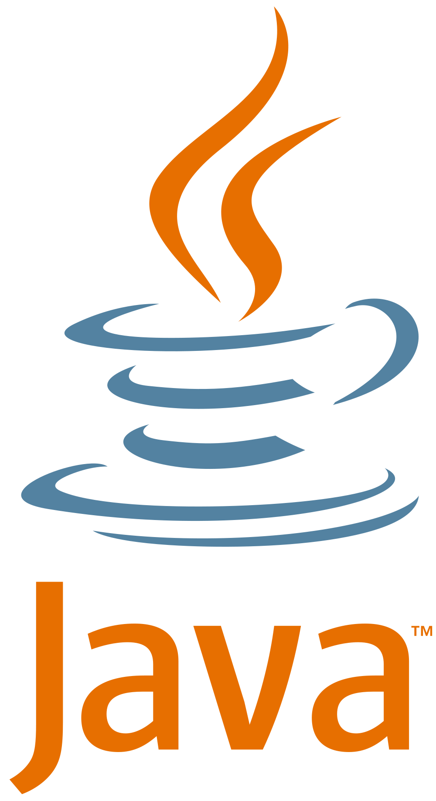

## Interests in Software Engineering

So far in my college career, I've found an interest in front-end and back-end software development. I've worked with Angular.js as a web framework and I really enjoy programming a user interface and making things as user-friendly as possible. The front-end is really all users see when they go to a website or use a web application, paying little to no attention to what goes on behind the scenes. This fact provides me with an extra motivation to really impress users with the final product.

While the front-end is what users see, I believe the back-end data analytics is the more important of the two. For the back-end, I've used C/C++ to implement different algorithms for data processing. Without a back-end to any software, the front-end becomes nothing more than an interface for users to interact with nothing. In the back-end, I'm particularly interested in algorithm development and database management. These two parts of the back-end are significant and allow the front-end to display appropriate information.

## Expectations for the Future

Some of the skills I hope to develop in the future are learning more programming languages and using them to develop useful software to help society. Some of the languages I'd like to learn are Java, Python, and C#. Furthermore, I'd like to hone my skills with the current languages I know including C/C++, JavaScript and HTML/CSS. I've yet to get more experience developing software with these languages.

Some experiences I'd like to have in the future are working on large scale software projects intended for numerous users (i.e. cyber security software, game development, etc.). So far, I've only worked on small projects within groups in classes with no real impact on society. Though these are also valuable experiences, nothing can compare to that of working on software intended for actual people. Another experience I'd like to have is to work at a big company like Apple or Microsoft. Regardless of what I need to do, I'd want to know what it's like to have a rigorous work schedule and be able to satisfy customers worldwide.
