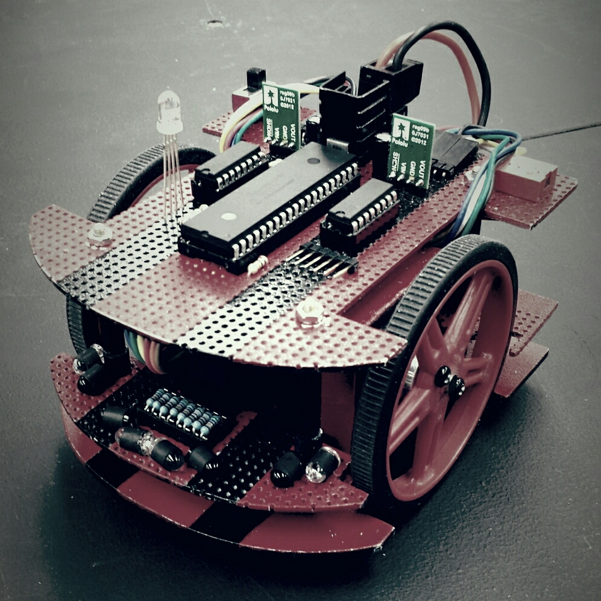
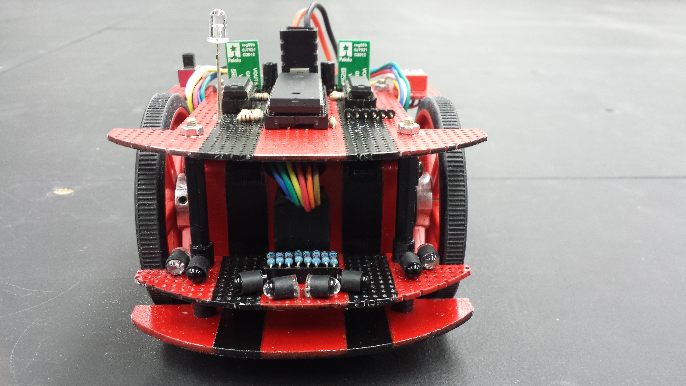

  
  

Micromouse is a competetion where robotic "mice" must find the center of a 16x16 maze. The mouse itself must be entirely autonomous and find the center of the maze from a given location. A variety of hardware is used to accomplish this, including sensors, microprocessors, motors, etc. A common algorithm to solve the maze is a flood-fill algorithm where the maze is "flooded" and the path that the "water" reaches first is the optimal path for the mouse to take. To further reduce the time it takes to reach the center, acceleration and deceleration of the mouse can be tuned accordingly to allow the mouse to travel through the maze.

I worked in a team of four and handled most of the hardware for the mouse which included building the circuit for the mouse and some of the soldering of the components onto a perforated board. However, I also worked on the programming of the mouse and developing a consistent "wall-hugger" algorithm for the mouse. The algorithm would follow a wall (either the left or right side) and continue to follow it until it found the center of the maze. Both left and right wall-hugger variants were implemented for the mouse. The algorithm allowed our mouse to solve a maze in approximately one minute. 

More information at the [UH Micromouse Website](http://www-ee.eng.hawaii.edu/~mmouse/about.html).

