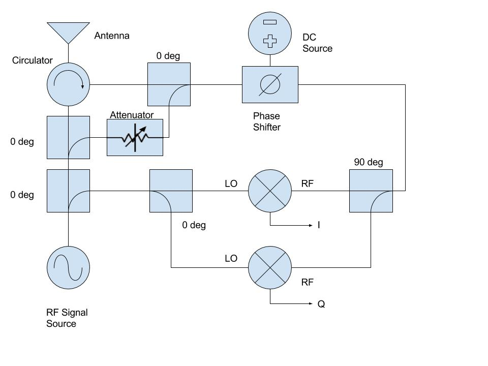

For this project, I worked with a team to develop a sensor that would detect human breathing. This sensor was creating using the radio frequency (RF) circuit shown and implemented on a printed circuit board (PCB). This sensor would act as a motion detector and could successfully detect human breathing, a rather difficult motion to detect.

As it turns out, human breathing produces a small displacement of the torso, up to several centimeters depending on how big or small a person is. Additionally, the frequency of this motion is < 5 Hz, also depending on how large a person is and what state their body is in (i.e. sleeping, sitting still, post exercise, etc.). Detecting this motion required an innovative use of phase shifters and an attenuator to enable the circuit to detect breathing.

This project taught me a lot about RF circuits and how they work. I never had prior experience with these types of circuits and this project showed me that they can be quite useful and have many applications. This was a small but major contribution to the overall goal of having a drone be able to go out on search and rescue missions.

A short description can be found [here](http://ee.hawaii.edu/student/project.php?stc=1&pco=2&pro=33).
