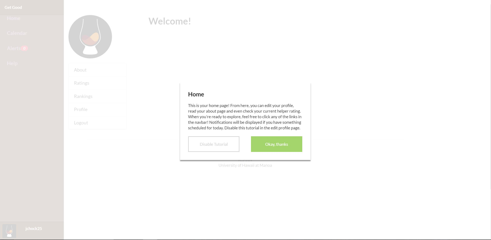

For this project, I worked with a team to develop a web app designed to allow students to study together. Students can plan sessions
together or on their own with a mentor of their choice. To give students an incentive to be mentors, a ranking system was implemented to
allow students to compete for the best mentor. My specific contributions included designing most of the page layouts, implementing the new
user tutorial (like above), help page, and login page. Throughout development, I also gave feedback to members about their implementations and helped out whenever someone was struggling. This project taught me a lot about issue driven project managment and furthered my understanding of both Meteor and web development overall.

The GitHub organization for the app can be found [here](https://get-good.github.io/).
