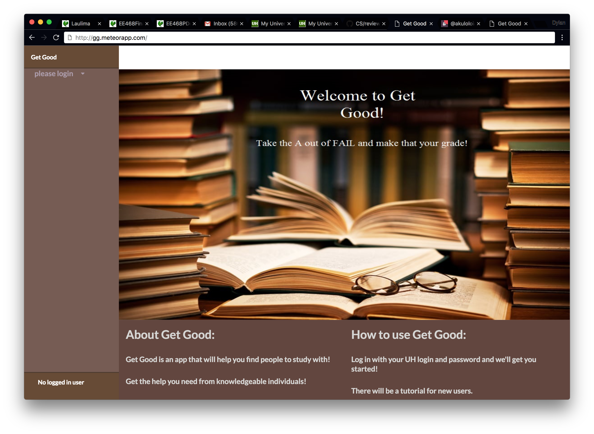

For this project, I worked with a team to develop a web app designed to allow students to study together. Students could plan sessions
together or on their own with a mentor of their choice. To give students an incentive to be mentors, a ranking system was implemented to
allow students to compete for the best mentor. An embedded calendar was used to schedule events and users could view events in a day, month, or list view. If users needed to make changes, they could do so by selecting their event. Users also had their own profiles with the ability to choose a profile picture, give some information about themselves, and choose which courses they wanted to offer or receive help in.

My specific contributions included designing most of the page layouts, implementing the new user tutorial (shown above), help page, and login page. These components were crucial to the app as they provided key functionality for users to get started with the app. Throughout development, I also gave feedback to members about their implementations and helped out whenever someone was struggling. 

This project taught me a lot about issue driven project managment and furthered my understanding of both [Meteor](https://www.meteor.com/) and web development overall. I've had experience working on large projects before, and working on this project was a similar experience. However, the use of GitHub for managing issues and milestones was new. Thanks to this project, I'm able to use these skills in my future career and apply them to any project I work on.

The GitHub organization for the app can be found [here](https://get-good.github.io/).
